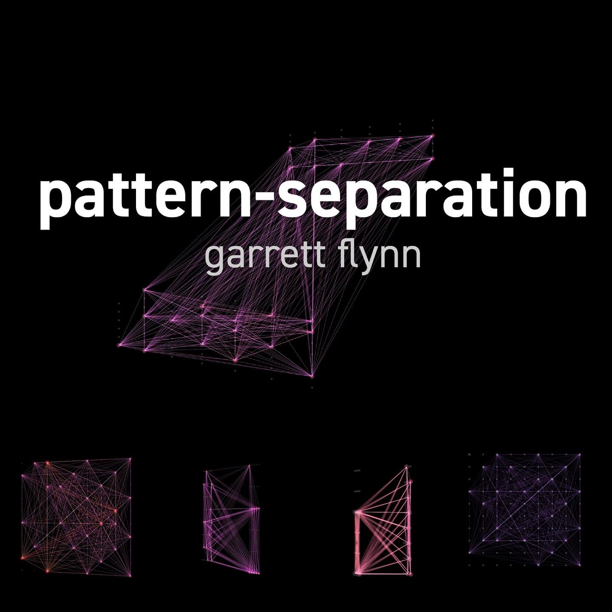
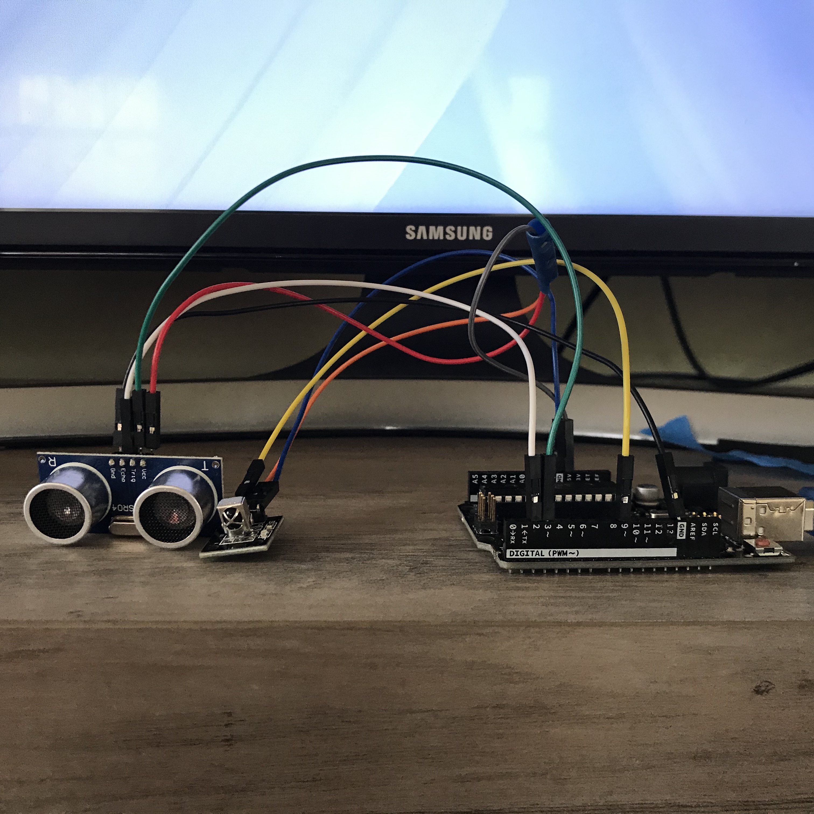
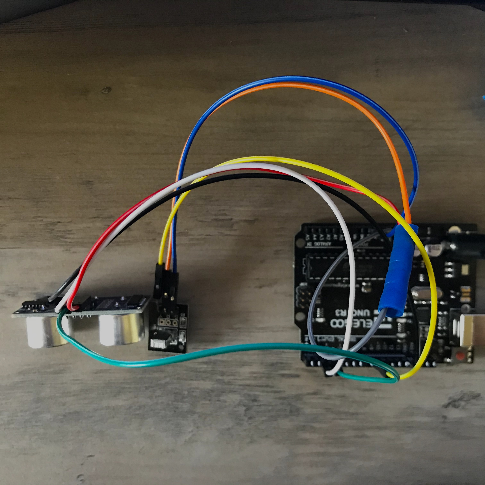
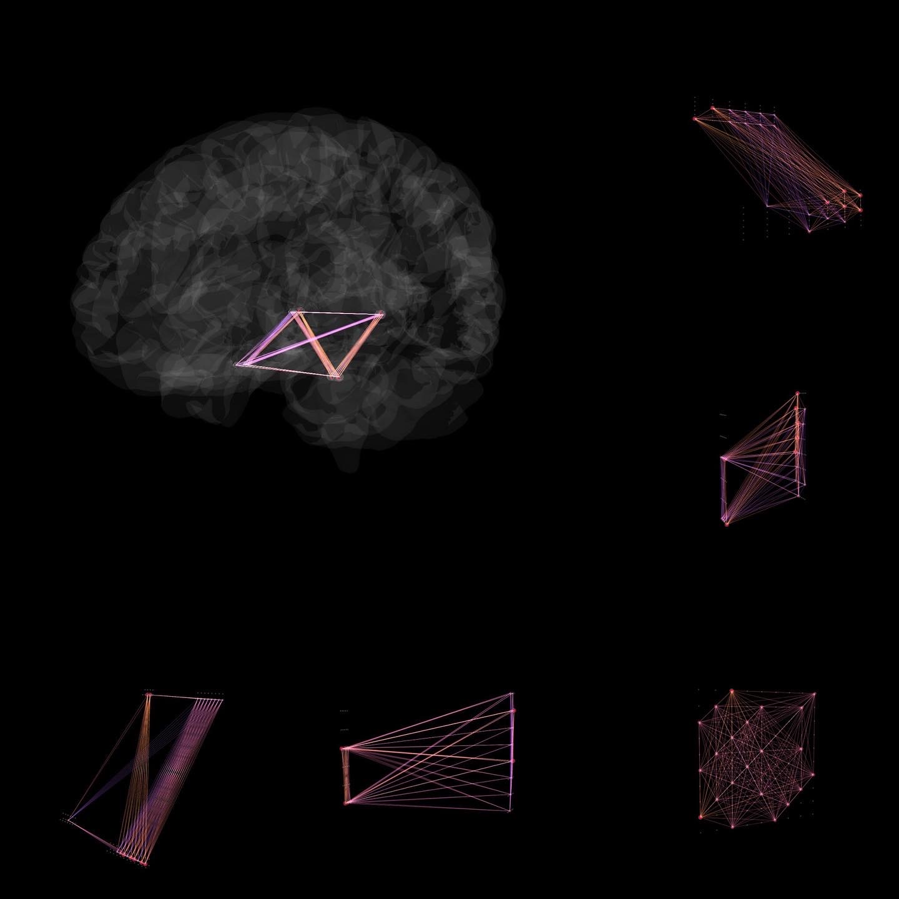
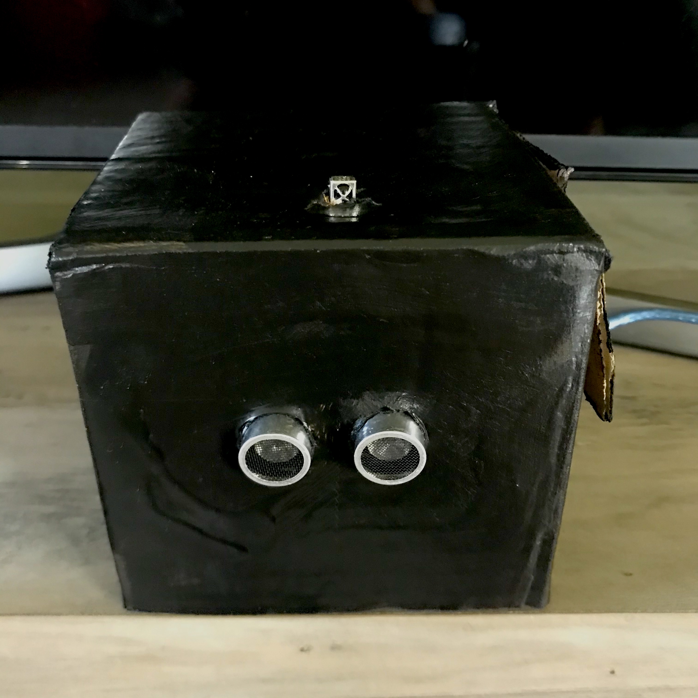
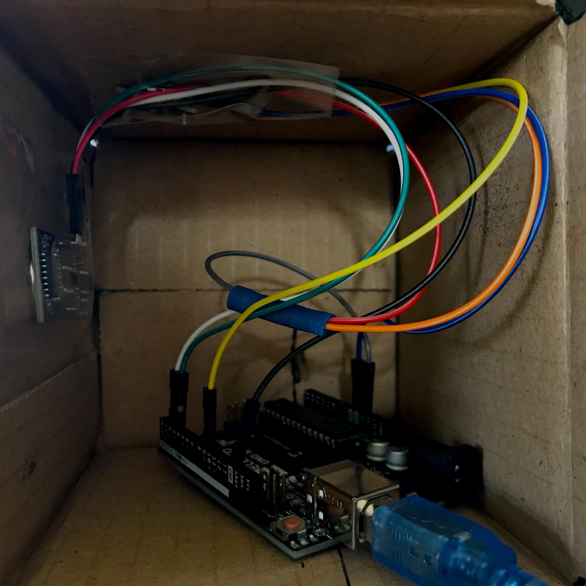
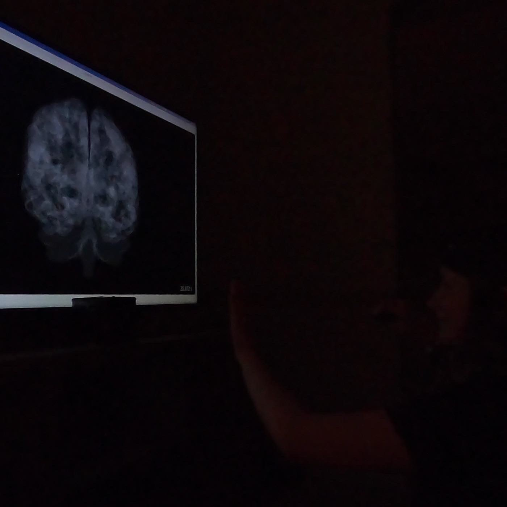
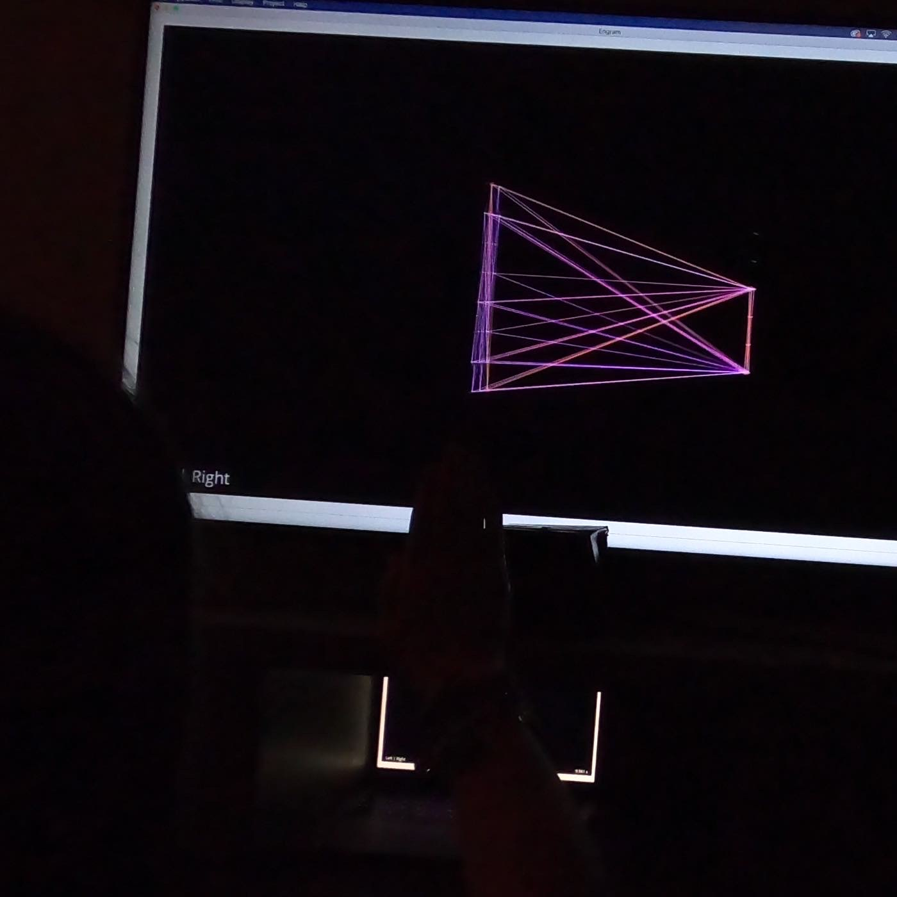
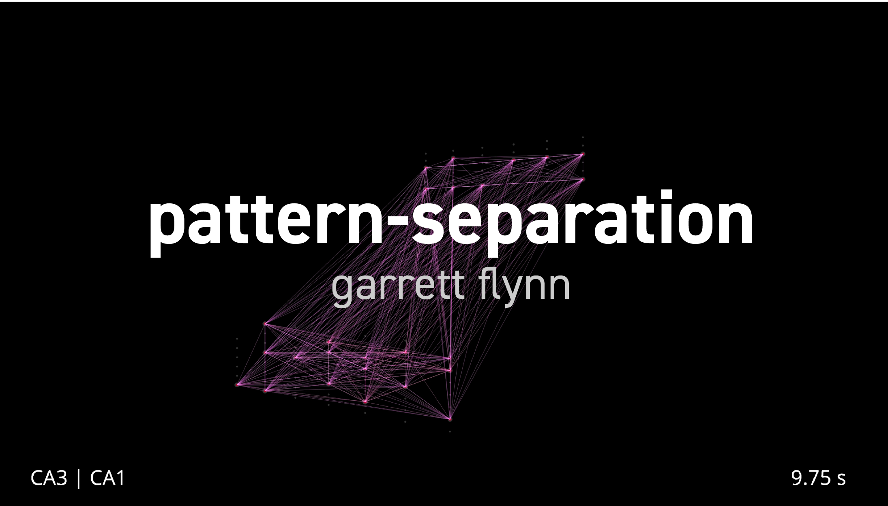

# pattern-separation
*A custom Visbrain environment for sorting neuronal spike trains*

[](https://youtu.be/dBMfB8UTing)

In the human brain, the hippocampus is theorized to transform non-simultaneous input patterns into less similar output patterns in a process known as "pattern separation", allowing us to distinguish similar memories from one another.

**pattern-separation** is a custom Visbrain environment for sorting neuronal spike trains. It sorts neuronal spike trains across all combinations of user-specified properties (e.g. left/right, anterior/posterior, CA1/CA3, etc). Additionally, Arduino ultrasonic and IR sensors were used to enable control of the system without access to the keyboard—-as well as allow user gestures to increase/decrease the amount of "pattern separation" within the custom Visbrain environment.

[](https://github.com/garrettmflynn/pattern-separation)
[](https://www.gnu.org/licenses/gpl-3.0)

* [Installation](#INSTALLATION)
* [Usage](#USAGE)
* [Examples](#EXAMPLES)
* [Support](#SUPPORT)
* [Acknowledgements](#ACKNOWLEDGEMENTS)

## INSTALLATION
### Code
1. Clone or download the [pattern-separation](https://github.com/garrettmflynn/pattern-separation) repository

2. Install [conda](https://docs.conda.io/projects/conda/en/latest/user-guide/install/).

3. Create a conda environment from the environment.yml file.

```bash
$ conda env create -f environment.yml
```

## USAGE
Default Settings upon Installation:
* Synthetic Data
* Keyboard Control

### Run with **Default Settings**
Enter the pattern-separation directory, then run pattern-separation.py.
```bash
$ python pattern-separation.py
```
### Load **Custom Data**
Example scripts for loading your own binary signals are included in the /data and /settings folders.

Enter the pattern-separation directory, then run pattern-separation.py.
```bash
$ python pattern-separation.py
```

### Enable **Remote + Gesture Control**

#### Wire Up Your Arduino


Front                         |  Top
:------------------------------:|:------------------------------:
  |  

#### Update the Control Method
On line 80, replace 
```python
id.episode(shader='separation', control_method='keyboard')
```
with
```python
id.episode(shader='separation', control_method='Remote_Gesture)
```

## EXAMPLES

### Multiple Views of a Single Point in Time



### Using **pattern-separation** for Interactive Art
#### Enclosure
Outside                         |  Inside
:------------------------------:|:------------------------------:
  |  

#### Interaction
Default Configuration                        |  Interaction = Separation
:------------------------------:|:------------------------------:
  |  
#### Documentation Video
[](https://youtu.be/dBMfB8UTing)

## DEPENDENCIES
This project uses the following libraries:
* [neo](https://github.com/NeuralEnsemble/python-neo) for loading real electrophysiology data
* [pandas](https://github.com/pandas-dev/pandas) for organizing data
* [pyserial](https://github.com/pyserial/pyserial) for communicating with Arduino Uno
* [scipy](https://github.com/scipy/scipy) for processing data and creating synthetic data
* [visbrain](https://github.com/EtienneCmb/visbrain) for creating the custom visualization environment

## SUPPORT

If you are having issues, please email me at garrett@garrettflynn.com

## ACKNOWLEDGEMENTS
This code was created for IML 404 (Tangible and Spatial Computing) taught by [John Carpenter](http://www.johnbcarpenter.com/) at the University of Southern California, and heavily influenced by my work with Dong Song at the [USC Center for Neural Engineering](https://cne.usc.edu/).